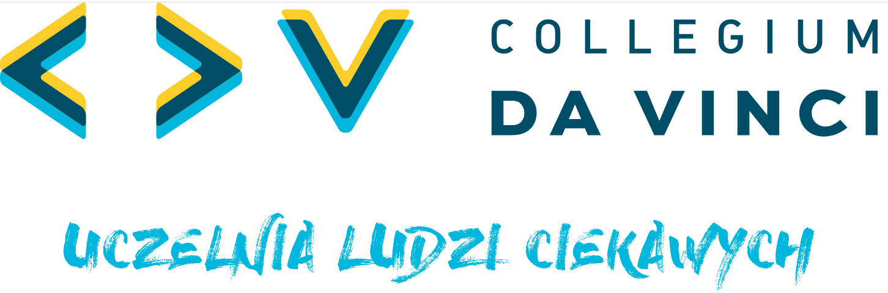

# Opis badanego zjawiska

TEKST

Przedstawiony problem został opisany w pracy [@knuth84]. Bieżący stan wiedzy na ten temat przedstawia @tbl-letters. Referencja do tabeli musi się zaczynać od **tbl-**, a do rysunku od **fig-**.

| Col1 | Col2 | Col3 |
|------|------|------|
| A    | B    | C    |
| E    | F    | G    |
| A    | G    | G    |

: Pewne losowe liczby w tabeli {#tbl-letters}

TEKST

{#fig-cdv}

Logo uczelni przedstawia @fig-cdv.
